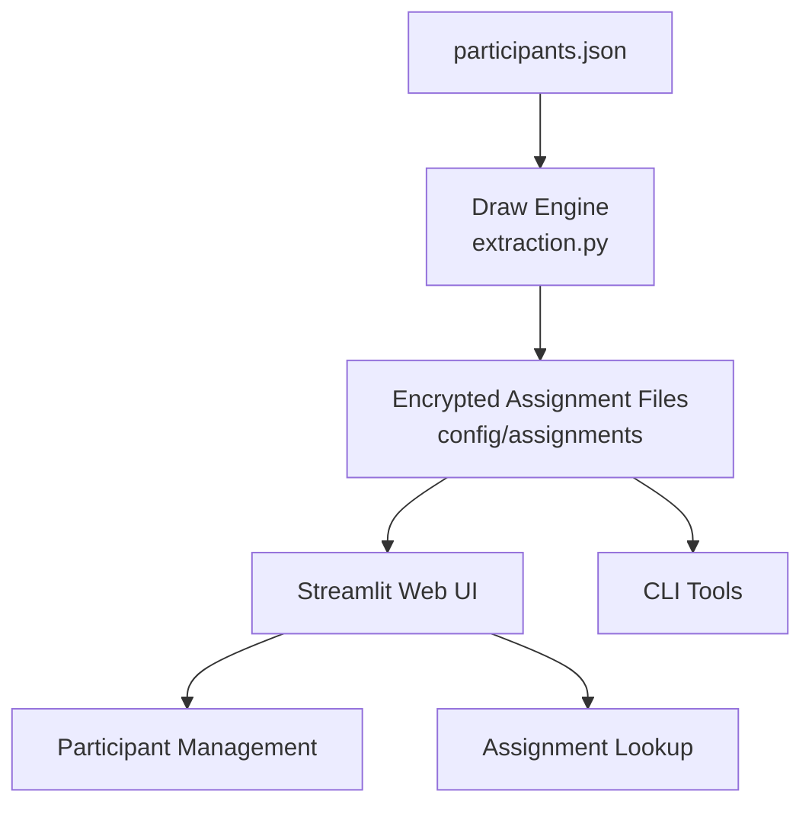

# Introduction

🎅 Secret Santa manager with encrypted assignments.

The application generates Secret Santa pairings while respecting participant constraints, stores assignments in encrypted form, and provides both a Streamlit web interface and command-line tools for managing participants and revealing assignments securely.

---

# Architecture

The application is built around a simple file-based architecture.

- `config/participants.json` acts as the source of truth and stores participant information, participation status, and exclusion constraints.
- The draw engine (`extraction.py`) reads the participant configuration, generates a valid Secret Santa assignment, encrypts each recipient name using Fernet, and writes one encrypted file per participant under `config/assignments/`.
- The Streamlit application provides a web interface for participant registration, activation/deactivation, deletion, and assignment lookup.
- Whenever the active participant list changes, a new draw is automatically generated to ensure assignment consistency.
- Participants can reveal their assignment either through the web interface or from the command line, using the encrypted assignment files generated by the draw engine.

This design avoids the need for a database and keeps the entire application state contained within a small set of configuration and assignment files.

---

# Startup

## Files to be configured

- `.env`: Contains environmental variables (see the template for more details)
- `participants.json`: Contains participants information for the secret santa extraction

## UI Secret Santa

### Start the Streamlit application:
    ./scripts/start_app.sh

- ### If connected to the same local network:
    http://localhost:$PORT_NUMBER

- ### If connected from a different network:
    Open the URL shown in the ngrok "Forwarding" field.

## CLI Secret Santa

### 1. Generate a new Secret Santa draw:
    venv_babbo/bin/python src/babbo_natale_segreto/extraction.py

### 2. Reveal an encrypted assignment from the terminal:
    ./scripts/estrazione.sh FirstName_LastName

(e.g. FirstName_LastName = Marco_Di_Carlos)
